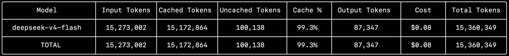

# Pi Statusline

An Amp-inspired input for Pi Coding Agent, with an optional sticky terminal layout that keeps the editor visible while chat history scrolls, plus a session cost breakdown command.

## Features

### 1. Amp-inspired input bar
Minimal chrome with rounded borders and information-rich labels:

- **Top-left:** Bash mode indicator (`$` prompt on `!` prefix) + live agent timer
- **Top-right:** Session cost, model name, thinking level (capitalized), context usage %
- **Bottom-left:** Git branch with dirty/ahead/behind indicators
- Auto-refreshing git status, timer, and cost

### 2. Sticky input
Keep the input bar pinned while chat history scrolls. Toggle with `/input-style`.

### 3. Cost breakdown (`/cost`)
Scans all sessions and shows an aggregated table:



- All values centered in their cells
- Costs always round down (floor to 2 decimals)
- Model names stripped of provider prefix
- Widget auto-dismisses when you start typing

### 4. Bundled themes
Two themes for a cohesive look:

- **`amp`** — Clean black & white with grey tones
- **`amp-colorful`** — Vibrant neon cyberpunk on deep purple

Select via `/settings` → Theme.

## Commands

| Command | Action |
|---------|--------|
| `/cost` | Show cost breakdown across all sessions |
| `/input-style` | Toggle sticky input on/off |
| `/settings` → Theme | Switch between bundled themes |

## Installation

### As a pi package

```bash
pi install /path/to/pi-statusline
pi install git:github.com/Raunak0713/pi-statusline
pi install npm:@raunak07/pi-statusline
```


# pi-statusline
